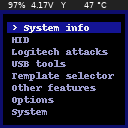

# GUI for P4wnP1
* Colorful UI interface for P4wnP1 ALOA
* Don't pwn just as a USB client. Use also the USB host capabilities!
* UPS Lite support
* Scalability (I tried my best to make it easier to add new menus)



I wanted to use also USB host capabilites of the P4wnP1.

So I implemented few scripts like Keystrokes->Duckyscript, Logitech dump with more scripts TODO; to make it more swissarmyknife like.


## ✅ Features
* System info
* Deploy HID attacks, templates
* Gamepad
* Dump logitech dongle (via munifying)
* Automatically backdoor logitech dongle (if logitacker present)
* Show images
* Plug-in rubberducky/keyboard and get duckyscript!
* Change UI colors


## ⚙ Setup
### Hardware

#### 📝 Requirements:
* Raspberry PI 0WH (02W untested)
* SD card
* [128x128 (1.44") Waveshare LCD HAT with joystick](https://www.waveshare.com/1.44inch-lcd-hat.htm)
* [UPS Lite - 1000 mAh battery module](https://www.aliexpress.com/item/32954180664.html)
* *optionally* [USB adapter](https://www.waveshare.com/pi-zero-usb-adapter.htm)

#### 🗡 For logitech attacks
* Any nRF52840 Dongle compatible with [LOGITacker firmware](https://github.com/RoganDawes/LOGITacker)
* USB HUB
* USB OTG cable

#### 🔨 Hardware tips

If you are planning to use the USB adapter you cannot solder it straight to the RPI.

You will need to place it under the UPS lite, because you will not be able to plug it in a laptop.


If you want smaller device you can shorten the pins on the raspberry pi. But I do not recommend it.

Instead solder new pins from bottom, with LCD had on them.


### 🧾 Software

Download latest [P4wnP1 aloa image](https://github.com/RoganDawes/P4wnP1_aloa/releases) on sdcard.

```bash
cd /root/
git clone https://github.com/gloglas/rpi_gui
sudo ./rpi_gui/setup.sh
```

If there are no errors just `reboot` your pi and you are set! 

## 💾 Config

It can be saved/loaded from *options* menu.

```json
{
    "COLORS": {
        "BACKGROUND": "#000000",
        "BORDER": "#0e0e6b",
        "GAMEPAD": "#141494",
        "GAMEPAD_FILL": "#EEEEEE",
        "SELECTED_TEXT": "#EEEEEE",
        "SELECTED_TEXT_BACKGROUND": "#141494",
        "TEXT": "#9c9ccc"
    },
    "PATHS": {
        "ANALYZED_HID": "/root/rpi_gui/ducky/",
        "ANALYZED_HID_LOGS": "/root/rpi_gui/log/",
        "BASH_SCRIPTS": "/usr/local/P4wnP1/scripts/",
        "HID": "/usr/local/P4wnP1/HIDScripts/",
        "IMAGEBROWSER_START": "/root/",
        "MUNIFYING": "/root/munifying/"
    },
    "PINS": {
        "KEY1_PIN": 21,
        "KEY2_PIN": 20,
        "KEY3_PIN": 16,
        "KEY_DOWN_PIN": 19,
        "KEY_LEFT_PIN": 5,
        "KEY_PRESS_PIN": 13,
        "KEY_RIGHT_PIN": 26,
        "KEY_UP_PIN": 6
    }
}
```

## 💻 Making your own menu

The menu class has its own structure. I'll try to explain it to you the best I can.

### Menu

Key `"a"` is a definition for menu.

If you are in `"ab"` menu and go one menu back, it will go to the `"a"` menu.

#### Items and structure

The items in menu in menu are in array.

First value is text displayed to the user.

The second value is:

* Menu which will be displayed next (specified by [a-z]) - `"ab"`
* Function with own stuff - `ShowInfo`
* Function with parameter - `[Templates, "WIFI"]` or `[SetColor, 2]`

```python
menu = {
    "a": (
        ["System info", ShowInfo],
        ["HID", "ab"],
        ["Logitech attacks", "ac"],
        ["USB tools", "ad"],
        ["Template selector", "aa"],
        ["Other features","ag"],
        ["Options", "ae"],
        ["System", "af"]
    ),
    "aa": (
        ["Full settings", [Templates, "FULL_SETTINGS"]],
        ["WiFi", [Templates, "WIFI"]],
    ..snip..
    "aea": (
        ["Background", [SetColor, 0]],
        ["Text", [SetColor, 2]],
    ..snip..
}
```

So If you want to add your own you just follow the example.

#### Function called from menu

Requires:

* It is recommended to set where we are (basically just that we are not in menu) with - `m.which = m.which + "1"`
* Draw empty background - `color.DrawMenuBackground()`
* Wait a few milliseconds so the user doesn't accidentally presses some button - `time.sleep(0.4)`
* After leaving the function, set the location accordingly with - `m.which = m.which[:-1]`

```python
def ShowInfo():
    m.which = m.which + "1"
    color.DrawMenuBackground()
    time.sleep(0.4)
    
    # Your stuff here

    m.which = m.which[:-1]
```

### 👍 Helper functions
#### Dialogs
##### Yes or No dialog


`def YNDialog(a="Are you sure?", y="Yes", n="No",b=""):`

Arguments: First line; text for YES; text for NO; Second line;
Returns: `True`/`False`

##### Dialog
`def Dialog(a, wait=True):`

Basic Message box

Arguments: Text; Waits for user to click ok;

##### Scroll trought text (like in menu)
`def GetMenuString(inlist,duplicates=False):`

Arguments: List of strings with labels to show; if your lists contains duplicates (to show it properly);
Returns: Selected `string` from array.

##### Show text without selection ("slide")
`def GetMenuPic(a):`

Arguments: List of lists with labels to show;
Returns: Index of selected slide (`-1` for none).

##### Wait for button press
`def getButton():`

Returns: Name of the pressed button defined in json config.

##### RGB color picker


`def GetColor(final_color="#000000"):`

Arguments: Color you start with;
Returns: `#RRGGBB`selected color in hex

### 📋 TODO
* More features for Logitech stuff
* Dump USB storage
* Construct HID payloads
* Terminal

### 📚 Credits and sources
* [Marcus Mengs](https://github.com/mame82) and [Rogan Dawes](https://github.com/RoganDawes) - [LOGITacker](https://github.com/RoganDawes/LOGITacker), [P4wnP1 ALOA](https://github.com/RoganDawes/P4wnP1_aloa), [Munifying](https://github.com/RoganDawes/munifying)
* BeBoXoS - [OLED menu](https://github.com/beboxos/P4wnP1_ALOA_OLED_MENU_V2)
* [UPS Lite repo](https://github.com/linshuqin329/UPS-Lite)
* [Waveshare HAT code](https://www.waveshare.com/wiki/File:1.44inch-LCD-HAT-Code.7z)
* gloglas - [Logitech dump and keystroke analyzer](https://github.com/gloglas/Plug-and-Dump)
